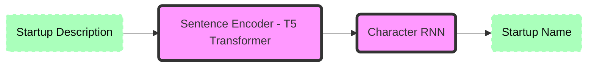

# stgen
Start-up Name Generator using a pretrained large language model and a character generation RNN using pytorch.

```mermaid
flowchart LR
    id1(Startup Description)-->id2(Sentence Encoder - T5 Transformer)
    id2(Sentence Encoder - T5 Transformer) --> id3(Character RNN) --> id4(Startup Name )
    
    style id1 fill:#afb,stroke:#fff,stroke-width:2px,color:#080808 ,stroke-dasharray: 5 5
    style id2 fill:#f9f,stroke:#333,stroke-width:4px
    style id3 fill:#f9f,stroke:#333,stroke-width:4px
    style id4 fill:#afb,stroke:#fff,stroke-width:2px,color:#080808 ,stroke-dasharray: 5 5
  
```

